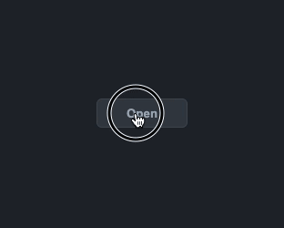

# vue-mzc-modal
Simple Vue2 modal component



[Online demo](https://codesandbox.io/s/competent-heisenberg-g9r0y?file=/src/App.vue)

## Installation
```sh
npm install vue-mzc-modal --save
```

## Usage
```js
import VueMzcModal from "vue-mzc-modal";
import "vue-mzc-modal/src/vue-mzc-modal.css";

export default {
  components: {
    VueMzcModal,
  },
  data() {
    return {
      opened: false,
    };
  },
};
```
```html
<button @click="opened = true">Open</button>
<vue-mzc-modal v-if="opened" title="Info" @close="opened = false">
  content...
</vue-mzc-modal>
```